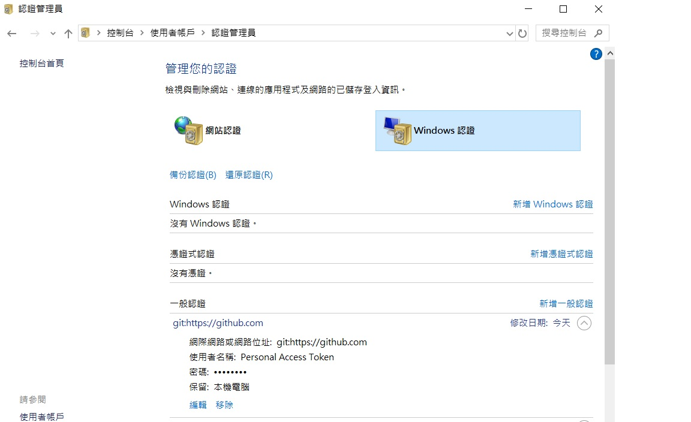

## github

### 解决 github push failed (remote: Permission to userA/repo.git denied to userB.)

remote: Permission to userA/repo.git denied to userB.
fatal: unable to access 'https://github.com/userA/repo.git/': The requested URL returned error: 403

以上說明userB沒有權限對userA進行push

使用指令檢查
git config --global --list

確實是userA

### 是什麼原因?

由於該電腦使用git bash配過SSH, 系統已經將指向github.com的用戶設置了userB 每次push操作的時候,都會讀取到userB的用戶訊息

可進入控制台移除github的windows認證

控制台\使用者帳戶\認證管理員

一般認證內 github.com該項展開 進行移除

之後push後輸入帳號密碼就完成囉~