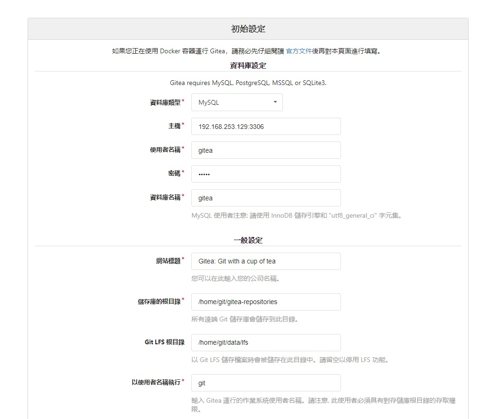
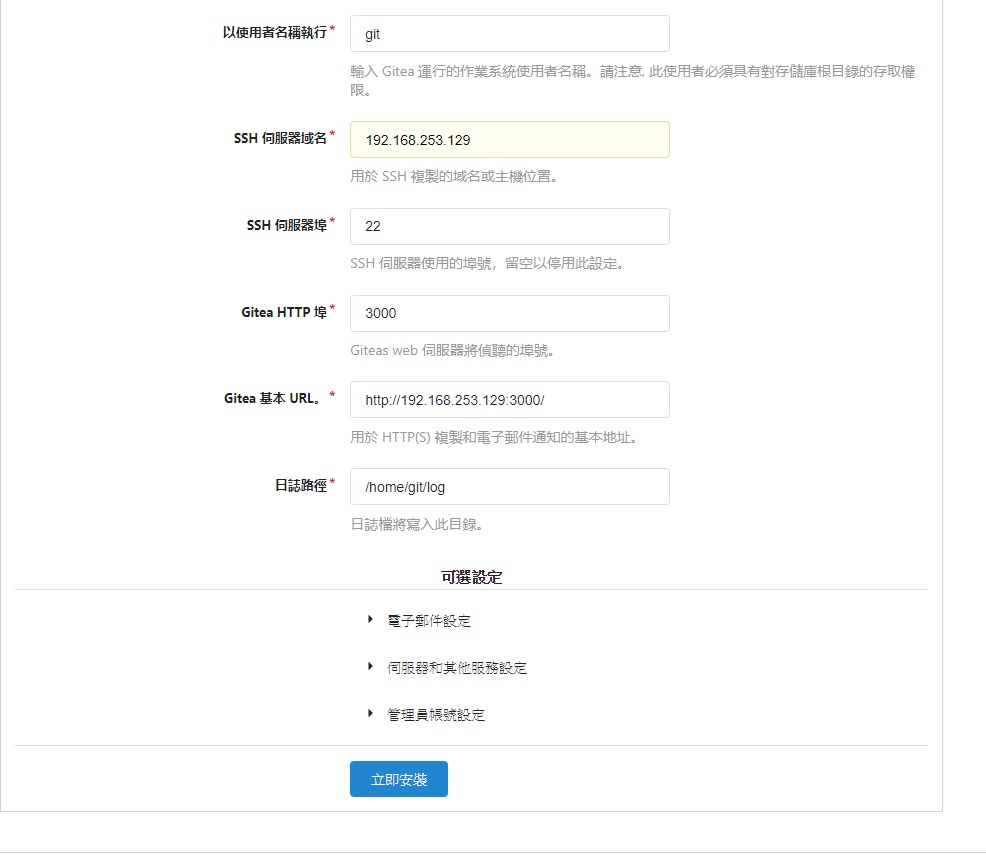

# Gitea 二進制執行檔 建置流程

    使用centOS7 mysql

## CentOS7 設定

### 開通網路

    vim /etc/sysconfig/network-scripts/ifcfg-ens33

    ONBOOT=yes

    重新啟動網路卡：
    ifdown ens33
    ifup ens33

### 開通防火牆 ex: 3000port

    查詢
    firewall-cmd --zone=public --list-all
    對外開放3000port
    firewall-cmd --zone=public --add-port=3000/tcp --permanent
    重新讀取設定黨
    firewall-cmd --reload
    再次查詢
    firewall-cmd --zone=public --list-all
    通了

# Gitea Install

Git Server 建置說明

## 安裝 mysql

### 安裝前檢查有無自帶 mysql

rpm -qa | grep mysql

### 有安裝的話先移除

rpm -e mysql 　　// 普通删除模式

rpm -e --nodeps mysql 　　// 强力删除模式

### MariaDB 管理 mysql

#### 使用 yum 安裝 mariadb

將以下資料輸入在一份文件中 (MariaDB.repo)

---

    [mariadb]
    name = MariaDB
    baseurl = http://yum.mariadb.org/10.3/centos7-amd64
    gpgkey = https://yum.mariadb.org/RPM-GPG-KEY-MariaDB
    gpgcheck = 1

---

    複制並粘貼到/etc/yum.repos.d/下的文件中 建議命名文件MariaDB.repo

#### 添加 Repo 之後，運行:(這應該強制重新加載存儲庫）

    sudo yum clean all

#### 然後運行:(這將列出 MariaDB 的可用存儲庫）。

    sudo yum list --showduplicates MariaDB-server

#### 再進行安裝

    sudo yum install MariaDB-server MariaDB-client

#### mariadb 簡單指令

    systemctl start mariadb  #啟動MariaDB

    systemctl stop mariadb  #停止MariaDB

    systemctl restart mariadb  #重啟MariaDB

    systemctl enable mariadb  #設置開機啟動

    systemctl status  mariadb #檢查服務運行狀態

### 驗證 mysql

    mysqladmin --version

### 登入 mysql

    mysql -uroot mysql -p
    預設無密碼

### 建立一個資料庫

    create database giteadb;

### 更改使用者權限

    grant all privileges on *.* to 'root'@'localhost';

### 更改使用者密碼

    UPDATE mysql.user SET password=PASSWORD("your_new_password") WHERE user="root";

#### 要記得執行(commit)

    flush privileges;

## 安裝 git2u

### 1. 若本來已有安裝 git，須先將之移除：

    sudo yum remove git

### 2. 安裝 epel-release repository 以免找不到必要的相依套件：

    sudo yum install epel-release

### 3. 安裝 IUS repository (for RHEL/CentOS 7)：

    sudo yum install https://centos7.iuscommunity.org/ius-release.rpm

### 4. 安裝 git2u：

    sudo yum install git2u

## 安裝 gitea

### 下載 gitea

可以先到https://dl.gitea.io/gitea/ 找版本

    wget -O gitea https://dl.gitea.io/gitea/master/gitea-master-linux-amd64

### 增加執行權限

chmod +x gitea

### 執行

    ./gitea web

## 進入安裝 gitea 頁面

    localhost:3000

### 創建資料庫相關設定

以下為參考用 請用實際資料庫正確資訊與正確 IP 設定

可以改 port

### 創建第一個帳號為管理員

之後關閉創建帳號後 就用這個管理員新增帳號

安裝完後可以停止 gitea 程序更改一下設定檔

### 設定檔

可到 custom/conf/app.ini 更改設定檔

設定 gitea 安全性

[repository]

    DEFAULT_PRIVATE：private：創建新存儲庫時默認為private。[最後，私人，公眾]

    DISABLE_HTTP_GIT：true：禁用通過HTTP協議與存儲庫交互的功能。

    USE_COMPAT_SSH_URI：true：當使用默認SSH端口時，強制ssh：//克隆url而不是scp-style uri。

[service]

    DISABLE_REGISTRATION：true：禁用註冊，之後只有管理員可以為用戶創建帳戶。

    REQUIRE_SIGNIN_VIEW：true：啟用此選項以強制用戶登錄以查看任何頁面。

[openid]

    ENABLE_OPENID_SIGNIN：false：允許通過OpenID進行身份驗證。

    ENABLE_OPENID_SIGNUP：false！DISABLE_REGISTRATION：允許通過OpenID註冊。

參考配置
https://docs.gitea.io/zh-tw/config-cheat-sheet/

## 背景執行

    nohup ./gitea web  > /dev/null 2>&1 &

### 停止

    ps -ef |grep gitea

    kill PID

# 自製憑證問題 [Git] 解決 Remote 遇到自我憑證 SSL certification problem

## 在使用 Git 執行遠端的操作時，若是自我憑證架的服務，可能會遇到顯示以下的錯誤

    fatal: unable to access 'https://192.168.0.1/project-dev/test.git/': SSL certificate problem: self signed certificate

## 解決方法： (註: 若不想全面開放就不要下這個指令)

    git config --global http.sslVerify false

## 單次不驗證：

    GIT_SSL_NO_VERIFY=true git clone https://192.168.0.1/project-dev/test.git

    或是

    git -c http.sslVerify=false clone https://192.168.0.1/project-dev/test.git

## 然後進入到該 repository 下(ex: cd test), 再下一次指定, 即未來此 repository (test)不需再做驗證

    cd test

    git config http.sslVerify false

參考: https://devmanna.blogspot.com/2018/06/git-remote-ssl-certification-problem.html
